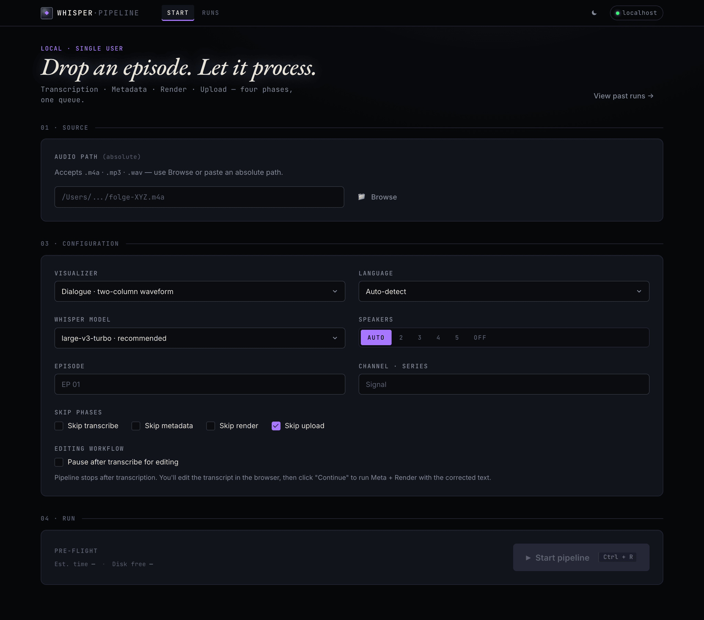
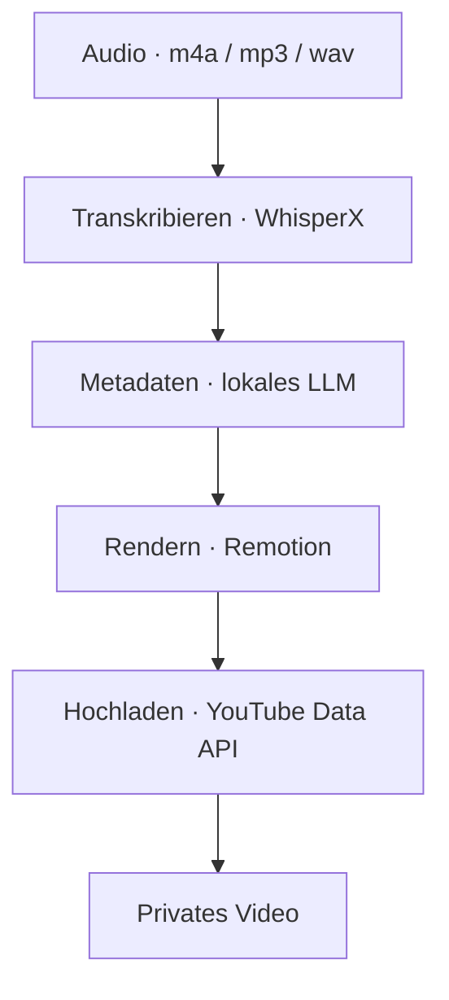
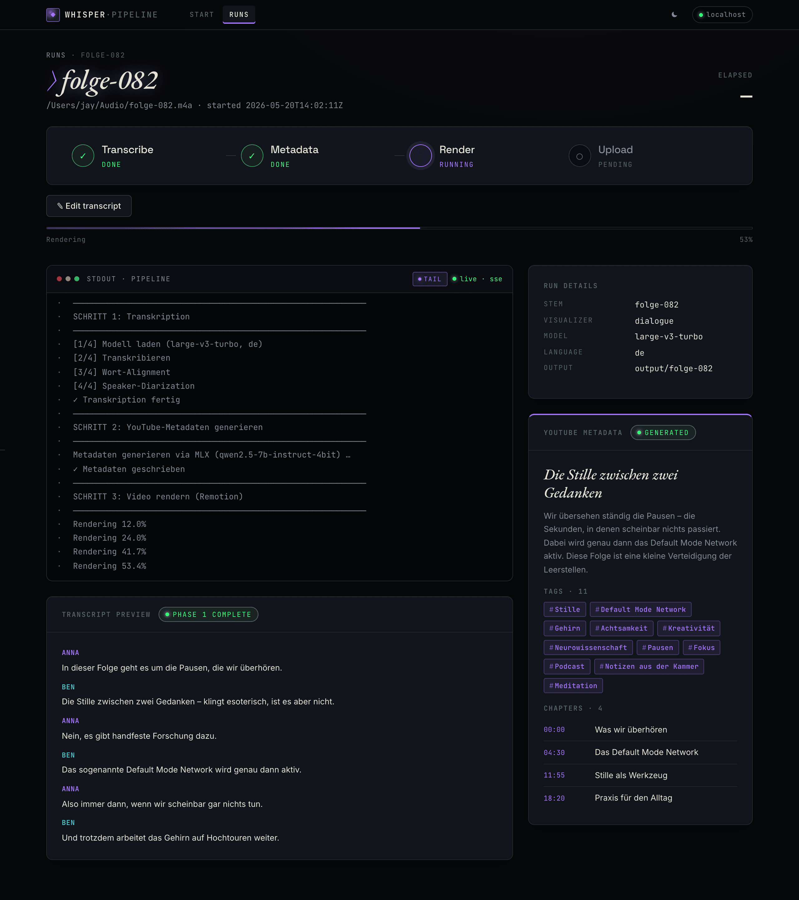
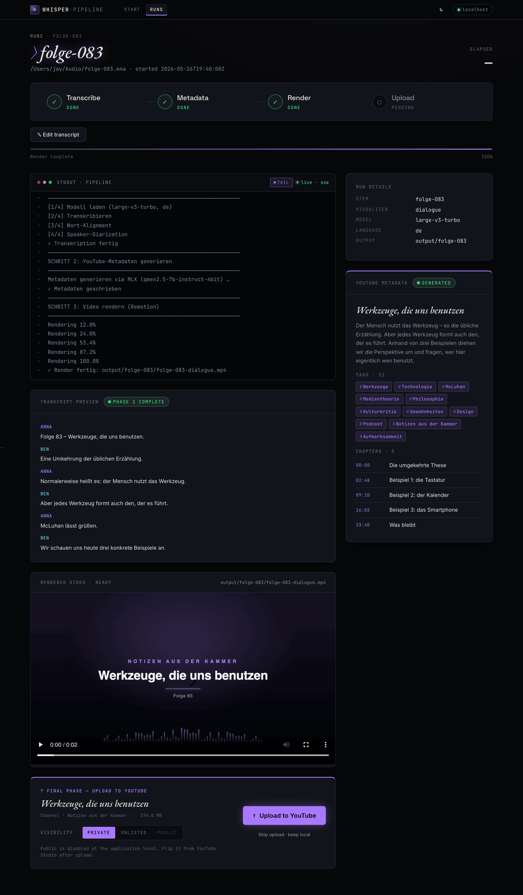
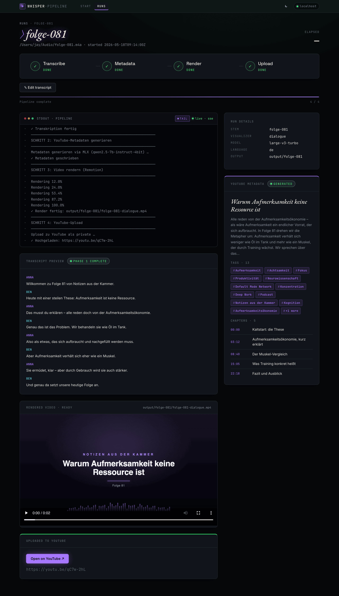
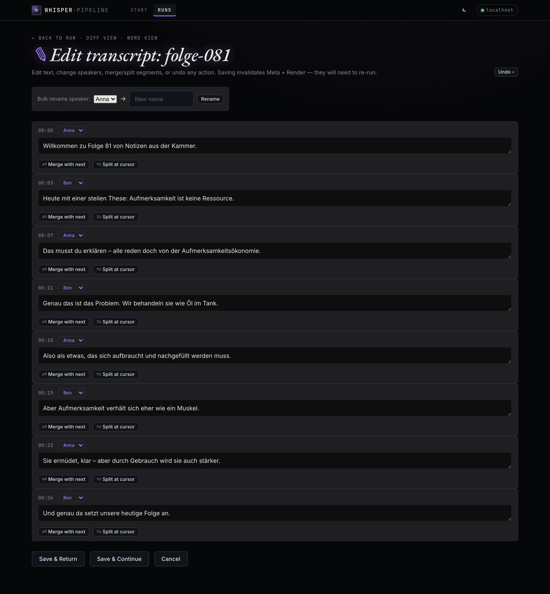
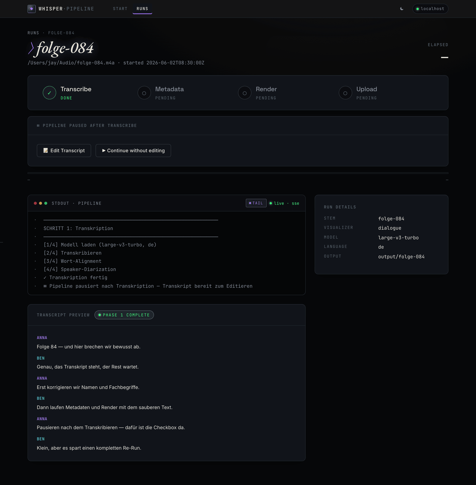

# podcast-to-youtube

[English](README.md) · **Deutsch**

[](https://www.gnu.org/licenses/agpl-3.0)
[](https://creativecommons.org/licenses/by-sa/4.0/)
[](https://git.jkaindl.de/jkaindl/podcast-to-youtube/releases/tag/v1.0.0)
[](https://github.com/johannes-kaindl/podcast-to-youtube/actions/workflows/ci.yml)
[](https://git.jkaindl.de/jkaindl/podcast-to-youtube/src/branch/main/tests)
[](https://www.python.org/)
[](https://www.apple.com/macos/)
[](https://git.jkaindl.de/jkaindl/podcast-to-youtube)

Automatisierte End-to-End-Pipeline: Podcast-Audio → fertiges YouTube-Video, läuft lokal auf Apple Silicon.

**Zielplattform:** Apple-Silicon-Mac, macOS 15+. Bewusst nur für Mac.

> **Status: v1.0.0 — erstes öffentliches Release.** Die vollständige Vier-Phasen-Pipeline läuft durchgängig von Anfang bis Ende; die WebGUI ist die primäre Schnittstelle. Mac Silicon, AGPL-3.0.

<p align="center">
  
</p>

<p align="center"><sub>Episode ablegen, Optionen wählen, Pipeline starten — alles läuft lokal.</sub></p>

---

## Über das Projekt

Eine einzelne Audiodatei (`.m4a` / `.mp3` / `.wav`) wird zu einem privaten YouTube-Video. Alles läuft lokal auf Mac-Hardware — Transkription mit WhisperX, Metadaten-Generierung mit einem lokal per MLX bereitgestellten LLM, Video-Rendering mit Remotion. Der einzige Netzwerkaufruf ist der YouTube-Upload selbst.

---

## Release-Status

Vollständige Release-Notizen pro Version siehe [`CHANGELOG.md`](CHANGELOG.md).

| Version | Datum      | Schlagzeile                                                                                                              |
| ------- | ---------- | ----------------------------------------------------------------------------------------------------------------------- |
| v1.0.0  | 2026-05-22 | **Erstes öffentliches Release** — Vier-Phasen-Pipeline (transcribe · metadata · render · upload), WebGUI + TUI, 64 Tests. |

---

## Features

Vier Phasen, eine Pipeline:



1. **Transkribieren** — WhisperX erzeugt ein Transkript auf Wortebene (JSON / SRT / TXT) mit Sprecher-Labels.
2. **Metadaten** — ein lokales MLX-LLM generiert Titel, Beschreibung, Tags und Kapitel für YouTube.
3. **Rendern** — Remotion rendert ein 1920×1080-MP4 mit einem Audio-Visualizer.
4. **Hochladen** — die YouTube Data API v3 veröffentlicht das Video als privat. Der Upload ist ein manueller, expliziter Schritt.

---

## Voraussetzungen

- **macOS auf Apple Silicon** — die Pipeline ist um WhisperX und ein lokal bereitgestelltes MLX-Modell herum gebaut.
- **[uv](https://docs.astral.sh/uv/)** für die Python-Umgebung · **Node.js** für den Remotion-Renderer.
- **ffmpeg** — Audio-Analyse und Rendering (`brew install ffmpeg`).
- **Ein lokaler, OpenAI-kompatibler LLM-Server auf Port 8080**, der das Modell für die Metadaten bereitstellt — siehe den zentralen [LLM-Setup-Guide](https://uplink.jkaindl.de/llm-setup). Welches Modell er bedient, wird über `MLX_MODEL` konfiguriert (siehe [Konfiguration](#konfiguration)).
- **Ein OAuth-Client in der Google Cloud** — `client_secrets.json` (Desktop App, mit aktivierter YouTube Data API v3). `upload_youtube.py` gibt die Einrichtungsschritte aus, falls die Datei fehlt.

---

## Installation

```bash
git clone https://git.jkaindl.de/jkaindl/podcast-to-youtube.git
cd podcast-to-youtube

# Python environment (uv reads pyproject.toml + uv.lock, creates .venv)
uv sync                       # add --extra transcribe for the WhisperX phase
source .venv/bin/activate

# system tools
brew install ffmpeg

# Remotion dependencies (once)
cd visualizer && npm install && cd ..

# YouTube OAuth (once — needs a real terminal for the browser flow)
python auth_youtube.py

# launch the WebGUI
python webgui.py
```

Die WebGUI öffnet sich unter `http://localhost:8765`.

---

## Verwendung

Zwei Oberflächen auf dieselbe Pipeline: die **WebGUI** ist das primäre Interface, die **CLI** fährt dieselben vier Phasen headless. Beide lesen und schreiben dieselbe `output/<stem>/run-state.json` — ein in der einen gestarteter Lauf lässt sich also in der anderen einsehen.

### WebGUI

`python webgui.py` startet eine FastAPI- + HTMX-Oberfläche und öffnet den Browser unter `http://localhost:8765`.

Audiodatei auswählen, Optionen wählen, **Pipeline starten** klicken. Die Run-Seite streamt das Live-Log und den Phasenfortschritt über Server-Sent Events. Nach der Render-Phase wird die MP4-Vorschau inline abgespielt. Der Upload erfolgt nie automatisch — wähle die Sichtbarkeit (privat / nicht gelistet) und klicke **Auf YouTube hochladen**.

<table>
  <tr>
    <td width="33%" valign="top">
      <a href="docs/images/webgui-running.png"></a>
      <br><sub><b>Laufender Durchlauf</b> — Phasen-Stepper, streamendes Log, Transkript &amp; Metadaten, sobald sie eintreffen.</sub>
    </td>
    <td width="33%" valign="top">
      <a href="docs/images/webgui-upload.png"></a>
      <br><sub><b>Bereit zum Hochladen</b> — Render-Vorschau steht bereit; du wählst die Sichtbarkeit und bestätigst. Nie automatisch.</sub>
    </td>
    <td width="33%" valign="top">
      <a href="docs/images/webgui-done.png"></a>
      <br><sub><b>Fertig</b> — alle vier Phasen abgeschlossen, Video gerendert und hochgeladen.</sub>
    </td>
  </tr>
</table>

| Taste | Aktion |
|---|---|
| `Ctrl+R` | Den Dialog „Pipeline starten“ öffnen |
| `Ctrl/Cmd+Z` | *(auf der Bearbeitungsseite)* Letzte Editor-Aktion rückgängig machen — das native Feld-Undo hat Vorrang, solange ein Texteingabefeld fokussiert ist |
| `Ctrl/Cmd+S` | *(auf der Bearbeitungsseite)* Speichern & zurück zur Run-Seite |

#### Transkript-Editor

Whisper vertippt sich gelegentlich bei Namen, Fachbegriffen und Fremdwörtern. Statt die gesamte Pipeline neu laufen zu lassen, ermöglicht der Editor, das Transkript zwischen den Phasen zu korrigieren und nur das neu laufen zu lassen, was sich geändert hat.

<p align="center">
  <a href="docs/images/webgui-editor.png"></a>
  <br><sub><b>Transkript-Editor</b> — Text- und Sprecher-Bearbeitung pro Segment, Merge/Split, Sammel-Umbenennung von Sprechern und Undo. Das Speichern lässt nur die betroffenen Phasen neu laufen.</sub>
</p>

Zwei Wege hinein:

- **Pause nach dem Transkribieren** — das Kontrollkästchen *Pause after transcribe for editing* im Startformular aktivieren. Die Pipeline stoppt, sobald Whisper fertig ist; die Run-Seite zeigt dann eine Schaltfläche *Edit Transcript* an.
- **Jederzeit bearbeiten** — jeder Durchlauf mit einem Transkript zeigt auf der Run-Seite einen Link *Edit transcript* an. Das Speichern einer Bearbeitung setzt die Phasen `meta` + `render` auf `pending` zurück; klicke auf die Phasenanzeige, um sie mit dem korrigierten Transkript neu laufen zu lassen.

<p align="center">
  <a href="docs/images/webgui-paused.png"></a>
  <br><sub><b>Pause nach dem Transkribieren</b> — die Pipeline stoppt nach Whisper; bearbeite das Transkript und fahre dann mit Meta + Render fort.</sub>
</p>

Was der Editor kann:

- **Segment-Text** — vertippte Namen, Fachbegriffe und Fremdwörter korrigieren.
- **Sprecher-Neubeschriftung** — den Sprecher pro Segment ändern oder `SPEAKER_00` → `Anna` im gesamten Transkript sammelweise umbenennen.
- **Segmente zusammenführen / teilen** — zwei aufeinanderfolgende Segmente kombinieren oder eines an der Cursorposition teilen.
- **Bearbeitung auf Wortebene** — `/runs/<stem>/edit/words` öffnet eine Tabelle pro Wort für feinkörnigere Korrekturen.
- **Diff-Ansicht** — `/runs/<stem>/diff` zeigt Original gegen aktuelle Fassung, Wort für Wort.
- **Undo** — jede Aktion erstellt einen Schnappschuss des vorherigen Zustands. Das Undo-Dropdown zeigt die jüngste Historie; `Ctrl/Cmd+Z` macht die letzte Aktion rückgängig.

Das erste Speichern erstellt eine einmalige Sicherung `<stem>.whisperx.original.json`. Schnappschüsse sammeln sich in `output/<stem>/snapshots/` an und werden automatisch auf die 20 neuesten gekürzt.

---

### CLI

Die Pipeline läuft auch headless:

```bash
source .venv/bin/activate

# full run — transcribe, metadata, render, upload
python pipeline.py podcast.m4a

# skip the upload
python pipeline.py podcast.m4a --skip-upload

# pick a visualiser
python pipeline.py podcast.m4a --viz dialogue --skip-upload
python pipeline.py podcast.m4a --viz monologue --skip-upload

# speaker diarization (requires accepting the pyannote terms on huggingface.co)
python pipeline.py podcast.m4a --hf-token $HF_TOKEN

python pipeline.py --help
```

Ein Textual-TUI bleibt als Fallback-Frontend erhalten: `python tui.py podcast.m4a`.

Die Ausgabe landet in `output/<stem>/`:

- `<stem>.whisperx.json` — Transkript auf Wortebene mit Sprecher-Labels
- `<stem>.whisperx.original.json` — unberührte Sicherung, beim ersten Bearbeiten des Transkripts erstellt (siehe [Transkript-Editor](#transkript-editor))
- `<stem>.srt` — Untertitel
- `<stem>.txt` — Klartext-Transkript
- `<stem>.youtube-meta.json` — Titel, Beschreibung, Tags, Kapitel
- `<stem>-<viz>.mp4` — das fertige Video (1920×1080, 30 fps)
- `snapshots/<unix-ts>.json` — Undo-Schnappschüsse pro Mutation, vom Editor geschrieben; automatisch auf die 20 neuesten gekürzt

#### Skripte

| Skript | Zweck |
|---|---|
| `pipeline.py` | Orchestriert alle vier Phasen |
| `transcribe.py` | WhisperX: Audio → JSON / SRT / TXT |
| `generate_meta.py` | MLX-LLM: Transkript → YouTube-Metadaten |
| `render_video.py` | Remotion: Audio + Transkript → MP4 |
| `upload_youtube.py` | YouTube Data API v3: MP4 → privates Video |
| `auth_youtube.py` | Einmalige OAuth-Autorisierung |
| `download_models.py` | Alle Modelle für die Offline-Nutzung vorab laden |

---

## Konfiguration

| Datei | Inhalt |
|---|---|
| `client_secrets.json` | Google-OAuth-Zugangsdaten (nicht eingecheckt) |
| `.youtube_token.pickle` | Zwischengespeichertes OAuth-Token (nicht eingecheckt) |
| `playlists.json` | Automatische Playlist-Zuordnung — von `playlists.example.json` kopieren |
| `.env` | Optionale Umgebungsvariablen |

Umgebungsvariablen:

- `MLX_BASE_URL` — Basis-URL des lokalen LLM-Servers (Standard `http://localhost:8080/v1`)
- `MLX_MODEL` — die Modell-ID des lokalen LLM
- `HF_TOKEN` — Hugging-Face-Token für die Sprecher-Diarisierung

### Offline-Nutzung

`python download_models.py` lädt die Whisper- und Alignment-Modelle vorab, sodass die Pipeline ohne Internet läuft (außer dem Upload). `--hf-token` fügt das Diarisierungs-Modell hinzu; `--status` zeigt den Cache-Zustand an.

---

## Testsuite

```bash
uv run pytest tests/ -q        # or: make test
```

151 Unit- und Integrationstests, die den gemeinsamen Pipeline-Kern, die Probe- und Run-Historie-Helfer, den Job-Runner, jede WebGUI-Route und die vier Transkript-Editor-Module (`transcript_editor`, `transcript_segment_ops`, `transcript_word_ops`, `transcript_history`, `transcript_diff`) abdecken. Läuft in ~3 s auf Apple Silicon.

---

## Dokumentation

Das vollständige Benutzerhandbuch liegt in [`docs/manual/`](docs/manual/), gegliedert nach [Diátaxis](https://diataxis.fr/):

- **[Tutorial](docs/manual/tutorial.md)** — dein erstes Video, von Anfang bis Ende.
- **[How-to-Anleitungen](docs/manual/how-to.md)** — fokussierte Rezepte (Headless-Durchläufe, Transkript-Bearbeitung, Offline-Modelle, Upload-Sichtbarkeit).
- **[Referenz](docs/manual/reference.md)** — jedes CLI-Flag, jede WebGUI-Route, das `run-state.json`-Schema, Konfiguration + Umgebung.
- **[Erläuterung](docs/manual/explanation.md)** — die Vier-Phasen-Architektur und die Designbegründung.

---

## Projektaufbau

```
pipeline.py            Orchestrator — four phases, writes run-state.json
pipeline_core.py       Shared helpers (TUI + WebGUI)
transcribe.py          WhisperX step
generate_meta.py       Metadata step (local MLX LLM)
render_video.py        Render step (Remotion)
upload_youtube.py      Upload step (YouTube Data API v3)
transcript_editor.py        Editor V1 — load / save / regen / invalidate
transcript_segment_ops.py   Editor — merge, split, change_speaker, bulk_rename
transcript_word_ops.py      Editor — load_words_flat, save_word_edits
transcript_history.py       Editor — snapshot, undo_last, cleanup_snapshots
transcript_diff.py          Editor — compute_segment_diff vs .original.json
webgui/                FastAPI app — routes, job runner, SSE, templates, static
webgui.py              WebGUI entry point
tui*.py                Textual TUI (fallback frontend)
visualizer/            Remotion project (Node) — the video renderer
tests/                 pytest suite
docs/                  Design specs, implementation plans, screenshots
tools/                 Dev tooling (e.g. screenshot regeneration)
pyproject.toml         Project metadata, deps, and ruff/mypy/pytest config (uv)
uv.lock                Pinned dependency lockfile
Makefile               Standard targets (install / check / serve / …)
```

---

## Mitwirken

Issues und Pull Requests sind willkommen auf der [Forgejo-Instanz des Projekts](https://git.jkaindl.de/jkaindl/podcast-to-youtube) — die Issue-Vorlagen in [`.forgejo/issue_template/`](.forgejo/issue_template/) fragen alles Nötige ab. Für größere Änderungen öffne bitte zuerst ein Issue. Siehe [`CONTRIBUTING.md`](CONTRIBUTING.md) für den Entwicklungs-Workflow und [`SECURITY.md`](SECURITY.md) für sicherheitsrelevante Meldungen.

---

## Projektstatus

Aktiv gepflegt von einer einzelnen mitwirkenden Person. Fokus auf Apple Silicon — die Pipeline ist bewusst nur für Mac. Plattformübergreifende Pull Requests werden angenommen, aber nicht aktiv vorangetrieben.

---

## Lizenz

Code: AGPL-3.0-or-later ([`LICENSE`](LICENSE)). Dokumentation: CC BY-SA 4.0 ([`LICENSE-DOCS`](LICENSE-DOCS)).

Die AGPL-Netzwerkklausel hält Änderungen an einer vernetzten Bereitstellung quelloffen. Eine **kommerzielle Lizenz** ist für Nutzungen verfügbar, die die AGPL-Bedingungen nicht erfüllen können — siehe [`LICENSING.md`](LICENSING.md). Externe Beiträge werden unter der [`CLA.md`](CLA.md) angenommen.

---

Copyright (C) 2026 Johannes Kaindl.
