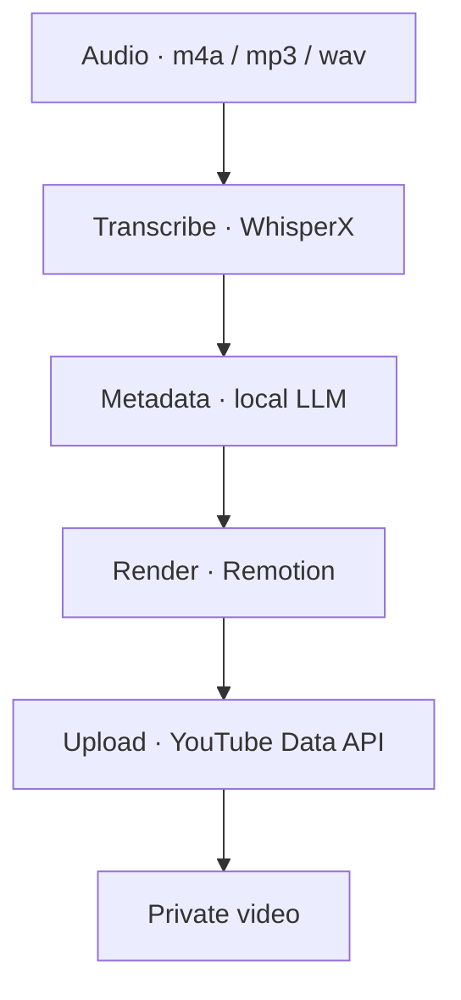

# podcast-to-youtube

[](https://www.gnu.org/licenses/agpl-3.0)
[](https://codeberg.org/jkaindl/podcast-to-youtube/releases)
[](https://codeberg.org/jkaindl/podcast-to-youtube)

Automated end-to-end pipeline: podcast audio → finished YouTube video, running locally on Apple Silicon.

**Target platform:** Apple Silicon Mac, macOS 15+. Mac-only by design.

> **Status: v1.0.0 — first public release.** The full four-phase pipeline runs end-to-end; the WebGUI is the primary interface. Mac Silicon, AGPL-3.0.

---

## About

A single audio file (`.m4a` / `.mp3` / `.wav`) becomes a private YouTube video. Everything runs locally on Mac hardware — transcription with WhisperX, metadata generation with a local MLX-served LLM, video rendering with Remotion. The only network call is the YouTube upload itself.

---

## What it does

Four phases, one pipeline:



1. **Transcribe** — WhisperX produces a word-level transcript (JSON / SRT / TXT) with speaker labels.
2. **Metadata** — a local MLX LLM generates the YouTube title, description, tags and chapters.
3. **Render** — Remotion renders a 1920×1080 MP4 with an audio visualiser.
4. **Upload** — the YouTube Data API v3 publishes the video as private. Upload is a manual, explicit step.

---

## Quick start

```bash
git clone https://codeberg.org/jkaindl/podcast-to-youtube.git
cd podcast-to-youtube

# Python environment
uv venv .venv --python 3.12
source .venv/bin/activate
uv pip install -r requirements.txt

# system tools
brew install ffmpeg

# Remotion dependencies (once)
cd visualizer && npm install && cd ..

# YouTube OAuth (once — needs a real terminal for the browser flow)
python auth_youtube.py

# launch the WebGUI
python webgui.py
```

The WebGUI opens at `http://localhost:8765`.

Two external prerequisites: a local **MLX server on port 8080** serving the metadata LLM, and a Google Cloud **OAuth client** (`client_secrets.json`, Desktop App, with the YouTube Data API v3 enabled). `upload_youtube.py` prints the Google Cloud setup steps if `client_secrets.json` is missing.

---

## WebGUI

`python webgui.py` starts a FastAPI + HTMX interface and opens the browser at `http://localhost:8765`.

Pick an audio file, choose the options, click **Start pipeline**. The run page streams the live log and phase progress over Server-Sent Events. After the render phase the MP4 preview plays inline. Upload is never automatic — choose the visibility (private / unlisted) and click **Upload to YouTube**.

| Key | Action |
|---|---|
| `Ctrl+R` | Open the start-pipeline dialog |

---

## CLI

The pipeline also runs headless:

```bash
source .venv/bin/activate

# full run — transcribe, metadata, render, upload
python pipeline.py podcast.m4a

# skip the upload
python pipeline.py podcast.m4a --skip-upload

# pick a visualiser
python pipeline.py podcast.m4a --viz dialogue --skip-upload
python pipeline.py podcast.m4a --viz monologue --skip-upload

# speaker diarization (requires accepting the pyannote terms on huggingface.co)
python pipeline.py podcast.m4a --hf-token $HF_TOKEN

python pipeline.py --help
```

A Textual TUI is kept as a fallback frontend: `python tui.py podcast.m4a`.

Output lands in `output/<stem>/`:

- `<stem>.whisperx.json` — word-level transcript with speaker labels
- `<stem>.srt` — subtitles
- `<stem>.txt` — plain-text transcript
- `<stem>.youtube-meta.json` — title, description, tags, chapters
- `<stem>-<viz>.mp4` — the finished video (1920×1080, 30 fps)

### Scripts

| Script | Purpose |
|---|---|
| `pipeline.py` | Orchestrates all four phases |
| `transcribe.py` | WhisperX: audio → JSON / SRT / TXT |
| `generate_meta.py` | MLX LLM: transcript → YouTube metadata |
| `render_video.py` | Remotion: audio + transcript → MP4 |
| `upload_youtube.py` | YouTube Data API v3: MP4 → private video |
| `auth_youtube.py` | One-time OAuth authorisation |
| `download_models.py` | Pre-fetch all models for offline use |

---

## Configuration

| File | Contents |
|---|---|
| `client_secrets.json` | Google OAuth credentials (not committed) |
| `.youtube_token.pickle` | Cached OAuth token (not committed) |
| `playlists.json` | Playlist auto-assignment — copy from `playlists.example.json` |
| `.env` | Optional environment variables |

Environment variables:

- `MLX_BASE_URL` — base URL of the local LLM server (default `http://localhost:8080/v1`)
- `MLX_MODEL` — the local LLM model id
- `HF_TOKEN` — Hugging Face token for speaker diarization

### Offline use

`python download_models.py` pre-fetches the Whisper and alignment models so the pipeline runs without internet (except the upload). `--hf-token` adds the diarization model; `--status` shows the cache state.

---

## Test suite

```bash
.venv/bin/python -m pytest tests/ -q
```

64 unit and integration tests covering the shared pipeline core, the probe and run-history helpers, the job runner and every WebGUI route.

---

## Project layout

```
pipeline.py            Orchestrator — four phases, writes run-state.json
pipeline_core.py       Shared helpers (TUI + WebGUI)
transcribe.py          WhisperX step
generate_meta.py       Metadata step (local MLX LLM)
render_video.py        Render step (Remotion)
upload_youtube.py      Upload step (YouTube Data API v3)
webgui/                FastAPI app — routes, job runner, SSE, templates, static
webgui.py              WebGUI entry point
tui*.py                Textual TUI (fallback frontend)
visualizer/            Remotion project (Node) — the video renderer
tests/                 pytest suite
docs/                  Design spec and implementation plan
```

---

## Contributing

Issues and pull requests are welcome at [Codeberg](https://codeberg.org/jkaindl/podcast-to-youtube). For larger changes, open an issue first. See [`CONTRIBUTING.md`](CONTRIBUTING.md).

---

## Project status

Actively maintained by a single contributor. Apple Silicon focus — the pipeline is Mac-only by design. Cross-platform pull requests are accepted but not actively driven.

---

## License

Code: AGPL-3.0-or-later ([`LICENSE`](LICENSE)). Documentation: CC BY-SA 4.0 ([`LICENSE-DOCS`](LICENSE-DOCS)).

The AGPL network clause keeps modifications to a networked deployment open-source.

---

Copyright (C) 2026 Johannes Kaindl.
